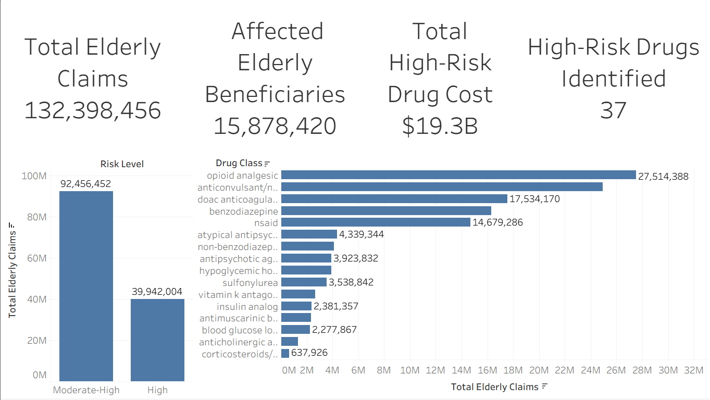
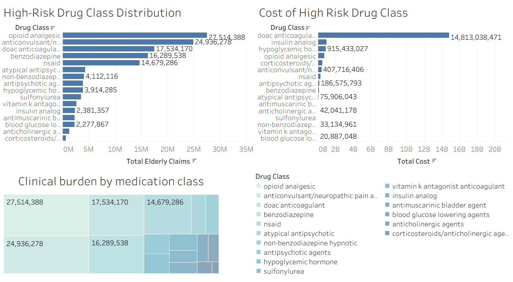
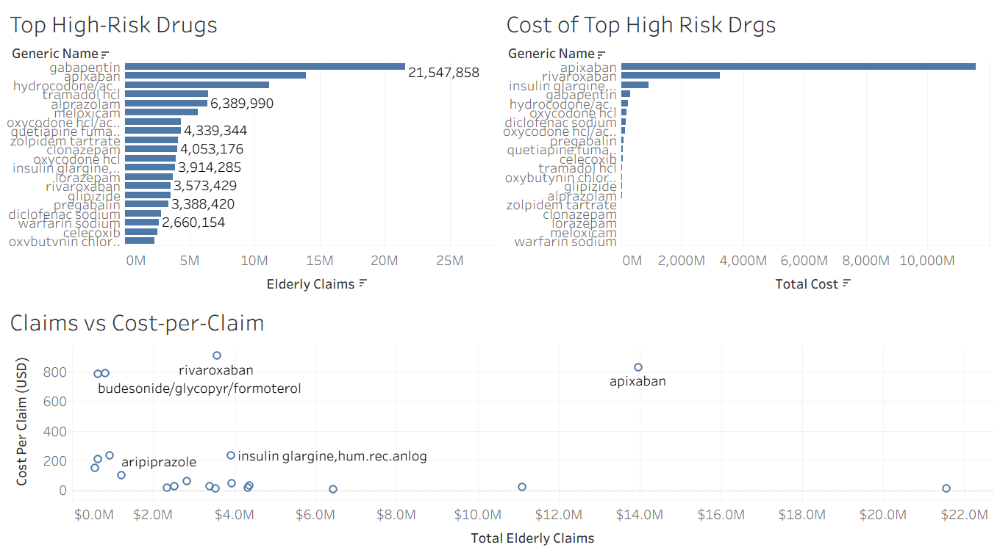
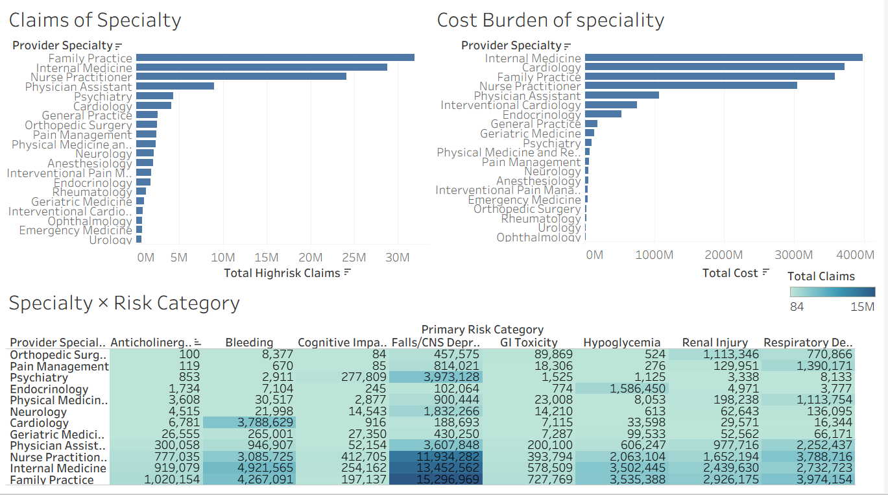
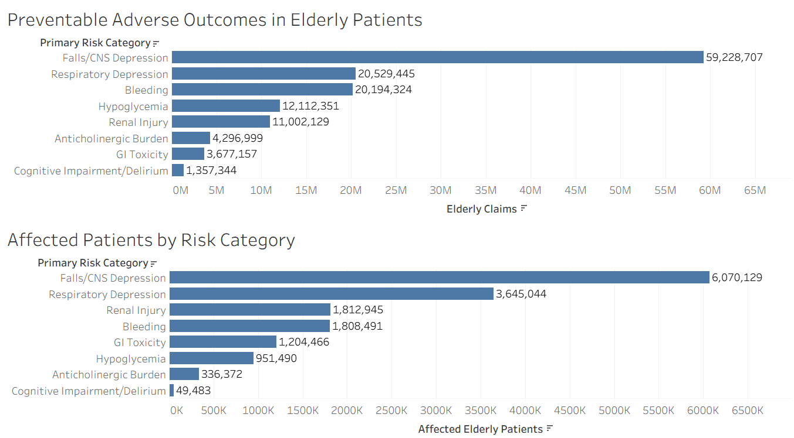
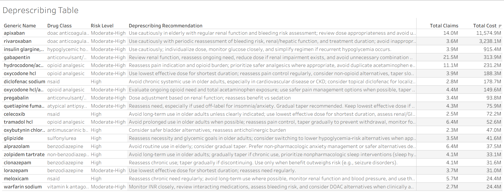

# Drug Utilization Review (DUR) in Elderly Patients

## Medicare Part D Real-World Evidence (RWE) Analysis

### Project Overview

This project performs a Drug Utilization Review (DUR) using real-world prescribing data from the CMS Medicare Part D Prescriber Public Use File. The analysis evaluates high-risk medication exposure among elderly Medicare beneficiaries (≥65 years) using Beers Criteria and STOPP/START-informed medication safety principles.

The project combines SQL-based healthcare analytics with interactive Tableau dashboards to identify prescribing burden, economic burden, preventable adverse outcomes, provider specialty risk patterns, and opportunities for deprescribing interventions.

---

## Problem Statement

Older adults are disproportionately exposed to high-risk medications that may increase the likelihood of falls, bleeding, cognitive impairment, hypoglycemia, respiratory depression, and other preventable adverse outcomes.

Healthcare organizations require real-world evidence to identify prescribing patterns, prioritize medication review programs, and support deprescribing interventions that improve medication safety among elderly populations.

This project aims to quantify the burden of high-risk medication use among elderly Medicare beneficiaries and identify opportunities to improve medication safety through evidence-based prescribing interventions.

---

## Dataset

**Source:** CMS Medicare Part D Prescriber Public Use File

The dataset contains prescription utilization and cost information for Medicare beneficiaries and enables evaluation of medication use patterns among elderly patients.

Key variables analyzed include:

* Prescriber specialty
* Generic drug name
* Elderly claims (≥65 years)
* Elderly drug cost
* Elderly beneficiaries
* High-risk medication classification
* Drug class
* Risk category
* Deprescribing recommendations

---

## Methodology

### Step 1: Elderly Drug Utilization Extraction

Created a dedicated elderly medication utilization dataset using:

* Elderly claims
* Elderly drug costs
* Elderly beneficiaries

---

### Step 2: High-Risk Medication Identification

Matched Medicare prescribing records against a curated medication risk reference table based on:

* Beers Criteria
* STOPP/START-informed prescribing principles
* Medication safety literature

---

### Step 3: DUR Analysis Dataset Creation

Integrated prescribing data with:

* Drug classes
* Risk levels
* Adverse outcome categories
* Deprescribing recommendations

to create a comprehensive DUR analysis table.

---

## SQL Analyses Performed

### 1. High-Risk Medication Burden Analysis

Evaluated:

* Total elderly claims
* Total healthcare cost
* Number of high-risk drugs
* Elderly beneficiaries

by risk level.

---

### 2. Drug Class Burden Analysis

Assessed prescribing burden and healthcare expenditure across high-risk medication classes.

Examples:

* Opioid analgesics
* Benzodiazepines
* Anticoagulants
* NSAIDs
* Anticholinergic medications

---

### 3. Top High-Risk Drug Analysis

Identified the most frequently prescribed high-risk medications among elderly patients.

---

### 4. Cost Burden Analysis

Calculated:

* Total drug cost
* Cost-per-claim
* Economic burden of high-risk medications

to identify medications generating substantial healthcare expenditure.

---

### 5A. Provider Specialty Risk Analysis

Determined which provider specialties contributed most to high-risk medication exposure.

Examples:

* Family Practice
* Internal Medicine
* Cardiology
* Psychiatry
* Pain Management

---

### 5B. Provider Specialty × Risk Category Heatmap

Evaluated the relationship between:

* Provider specialty
* Preventable adverse outcome categories

to identify specialty-specific medication safety concerns.

---

### 6. Preventable Adverse Outcomes Analysis

Quantified medication-related risk categories including:

* Falls/CNS Depression
* Respiratory Depression
* Bleeding
* Hypoglycemia
* Renal Injury
* Anticholinergic Burden
* Gastrointestinal Toxicity
* Cognitive Impairment/Delirium

---

### 7. Deprescribing Opportunity Analysis

Identified medications representing priority targets for:

* Medication review
* Dose optimization
* Safer therapeutic substitution
* Deprescribing interventions

---

## Key Findings

### Medication Burden

* Moderate-high risk medications accounted for the largest prescribing burden.
* More than 132 million elderly claims were associated with high-risk medications.

### Drug Classes

* Opioid analgesics represented the highest prescribing burden.
* Direct oral anticoagulants generated the highest healthcare expenditure.

### Top High-Risk Drugs

* Gabapentin demonstrated the highest utilization burden.
* Apixaban generated the highest overall medication cost.

### Preventable Adverse Outcomes

* Falls/CNS Depression represented the largest preventable adverse outcome burden.
* Bleeding-related outcomes generated the highest healthcare expenditure.

### Provider Specialty Risk

* Family Practice and Internal Medicine accounted for the largest high-risk prescribing burden.
* Cardiology demonstrated substantial bleeding-related cost burden due to anticoagulant use.

### Deprescribing Opportunities

Priority medication classes included:

* Opioids
* Benzodiazepines
* Anticoagulants
* NSAIDs
* Anticholinergic medications
* Hypoglycemia-inducing therapies

---

## Tableau Dashboards

### Dashboard 1 — Executive Overview

Includes:

* Total elderly claims
* Total elderly beneficiaries
* Total high-risk drug cost
* Number of high-risk drugs
* Risk-level distribution
* High-risk class distribution

---

### Dashboard 2 — Drug Class Burden

Includes:

* Drug class vs total claims
* Drug class vs total cost
* Drug class contribution treemap

---

### Dashboard 3 — Top High-Risk Drugs

Includes:

* Top drugs by claims
* Top drugs by cost
* Claims vs cost-per-claim scatter plot

---

### Dashboard 4 — Provider Specialty Risk

Includes:

* Specialty vs high-risk claims
* Specialty vs healthcare cost
* Specialty × risk category heatmap

---

### Dashboard 5 — Preventable Adverse Outcomes

Includes:

* Adverse outcome burden by risk category
* Patient burden visualization

---

### Dashboard 6 — Deprescribing Opportunities

Includes:

* Deprescribing recommendation table
* Risk-level filters
* Drug-class filters
* Medication prioritization tools
## Interactive Dashboard

Explore the complete Tableau dashboard:

🔗 [View Interactive Dashboard on Tableau Public](https://public.tableau.com/views/High-RiskMedicationUseinElderlyMedicarePatientsRWEDUR/ExecutiveOverview?:language=en-US&:sid=&:redirect=auth&:display_count=n&:origin=viz_share_link)
## Dashboard Gallery

### Executive Overview


### Drug Class Burden


### Top High-Risk Drugs


### Provider Specialty Risk


### Preventable Adverse Outcomes


### Deprescribing Opportunities

---

## Tools Used

* SQL (SQLite)
* Tableau Public
* Medicare Part D Data
* Real-World Evidence (RWE) Methodology
* Drug Utilization Review (DUR) Framework

---

## Repository Structure

```text
sql/
    dur_elderly_medicare_analysis.sql

data/
    high_risk_medication_burden.csv
    highrisk_drug_class_burden.csv
    top_highrisk_drugs.csv
    cost_burden_highrisk_drugs.csv
    provider_specialty_risk_analysis.csv
    specialty_risk_heatmap.csv
    preventable_adverse_outcomes.csv
    deprescribing_opportunity_analysis.csv

dashboard/
    dashboard_1_executive_overview.png
    dashboard_2_drug_class_burden.png
    dashboard_3_top_highrisk_drugs.png
    dashboard_4_provider_specialty_risk.png
    dashboard_5_preventable_outcomes.png
    dashboard_6_deprescribing_opportunities.png

docs/
    problem_statement.pdf
```

## Author

**Amna Sheraz**

Healthcare Data Analytics | Clinical Pharmacy | Real-World Evidence (RWE) | Drug Utilization Review (DUR) | Medication Safety Analytics
